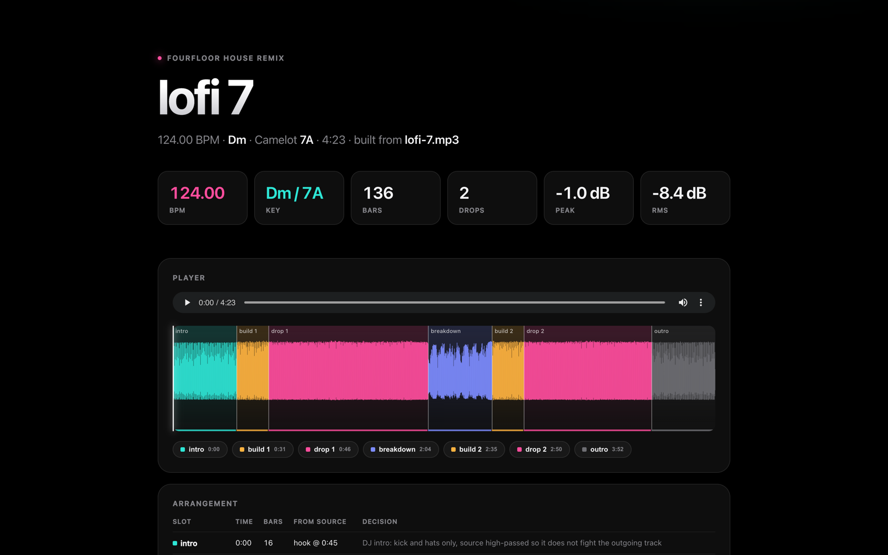
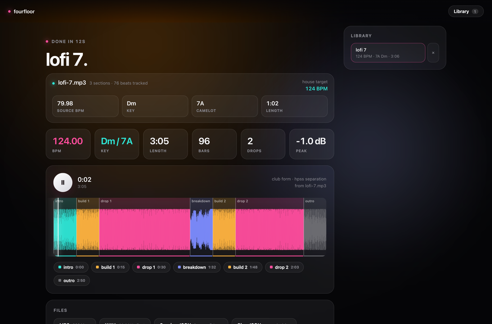
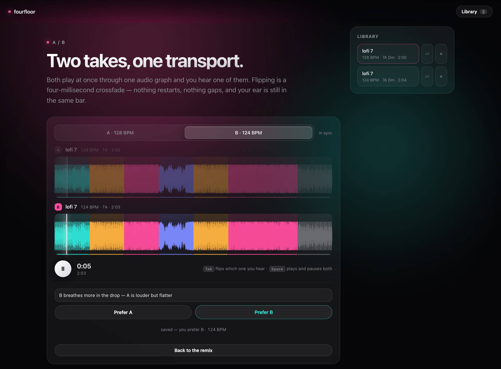

# fourfloor

**Put in an mp3 of any song. Get back a house remix — and a session file your DJ software can beat-match and cue against.**



## Why I built this

I have tons of house remixes of original songs on my drive. Some producer took a
track I love, put it on a four-on-the-floor grid, rebuilt the low end, and made
it work at 124. I wanted to make my own — and more than that, I wanted my DJ app
to make one for the *next* track, on the fly, while I'm playing.

So fourfloor does the whole job offline: it works out the tempo, the beat grid,
the key and the structure of a song, warps it onto a house grid, strips the
original drums, lays a real house kit under it — eight bars sampled off a record
you already like — keeps the song's own bass, arranges the result into a real
club form, and writes a `*.session.json` describing exactly where every downbeat
and cue point is. Then it measures its own work: there is a gate that reads a
finished remix and says, in milliseconds, whether the music is sitting on the
grid it was built on. That last file is the point. My DJ app
(MixPilot) reads BPM and key from local files;
now it can read a remix fourfloor just built and sync the transition into it
without re-analysing a thing.

No cloud, no API key, no model download. numpy and scipy, and ffmpeg for codecs.

## The app

`make serve` puts the whole pipeline behind a drop zone at
**http://127.0.0.1:4444** — drag a song in, watch it get read, choose the
tempo and key, and play the remix back with its section map.



```bash
make serve          # http://127.0.0.1:4444, control-c to stop
make serve PORT=8080
fourfloor serve --open
```

Drop an mp3, m4a, wav, flac or aiff (up to 200 MB) and it is analysed straight
away: detected tempo, key and Camelot code, and the structure it found, drawn
across the file. Pick a target tempo from the presets or type one, keep the key
or pick a new one off a Camelot wheel that lights up the keys which still mix
with the original — or hand it a second track and let it shift into something
compatible with *that*. Then choose the separation engine, the form, the length
and a style profile, and press Remix.

The pipeline streams its phases back as they happen (analyse, warp, separate,
arrange, render, write, each with its own timing), and the finished remix
arrives in a player with the waveform, the section map, cue chips you can jump
to, the arrangement table, and buttons for the mp3, the wav, the session JSON
and the plan JSON. Everything you build is kept in `~/.fourfloor/remixes/` and
listed in the sidebar, so you can come back to a remix and play it again, or
delete it.

It is the same code the CLI runs — the same pipeline, the same option
validation, the same session file — with a browser in front of it:

- it binds to **127.0.0.1** and checks the `Host` header, so nothing on your
  network or the internet can reach it;
- nothing is uploaded anywhere. The "upload" is a local file copy into
  `~/.fourfloor/sources/`, and the remix never leaves the machine;
- every option is parsed by the **CLI's own argument parser**, so the page
  cannot ask for anything `fourfloor remix` would refuse, and you get the same
  error message you would get in a terminal;
- ids are generated by the server and download names are an allowlist, so no
  path ever comes from the browser;
- one remix runs at a time, in a background worker, with the queue position
  reported while you wait.

No framework, no CDN, no build step: one stdlib HTTP server and three files of
vanilla HTML, CSS and JavaScript.

## Telling it what sounds wrong

fourfloor can measure a remix — tempo, key, peak, bar count — but it cannot
hear one. Everything it cannot measure has to come from somebody listening, and
that person's time is the scarce resource on this project. So the result screen
is also a notepad, and what gets written there lands next to the render where
the next person working on the code will find it.



**Mark what is wrong, where it is wrong.** While the remix plays, press
<kbd>M</kbd> (or hit **Mark**) and a popover opens at the playhead: pick a chip
— off-beat, vocal buried, drums fake, clash, rough transition, too loud, too
quiet, boring, *good* — add a line if you want to, and it is saved. Markers show
up as coloured pins on the waveform; hovering one shows the note, clicking one
plays from there. At the bottom, a star rating and a one-line verdict.

The bar number and the arrangement slot are not taken from the browser — the
server works them out from the remix's own `*.session.json` grid and
`*.plan.json`, so "bar 27" means the bar the arranger built, and a note about
the drop is filed against the drop.

**A/B two takes.** Pick anything in **Hear it against** — another render of the
same song, any other remix in the library, the track you dropped in, or a real
human remix of it if one is sitting in `~/Music/house-refs/pairs/` — and both
play at once with one shared transport. <kbd>Tab</kbd>, or the toggle, flips
which one you hear. Then vote, with a reason.

The flip is instant because nothing restarts: both `<audio>` elements feed one
`AudioContext` and the flip is a four-millisecond gain crossfade. That routing
is load-bearing rather than decorative — silencing a side with `muted`, or with
`volume = 0`, makes Chrome report that element's position off a different clock,
and the pair appear to jump 50–80 ms apart at every flip although the audio has
not moved. Through one graph they stay within a small fraction of a millisecond
of each other across a hundred flips.

**What the engineers read.** Everything is appended, with timestamps, to
`~/.fourfloor/remixes/<id>/feedback.json`, and every marker is also copied into
that remix's `*.session.json` under a `feedback` array — the session file is
what travels to another machine, and a note about bar 41 is worth nothing if it
stays behind. Nothing is edited in place, so re-rating a remix after a fix
leaves the first opinion on record and the pair reads as a before/after.

```bash
python -m fourfloor.feedback           # the digest
python -m fourfloor.feedback --json    # the raw records
python -m fourfloor.feedback --remix 4ff0c412b0b701c6
curl -s '127.0.0.1:4444/api/feedback?text=1'   # the same digest, from the app
```

```
fourfloor listening notes — 1 remix with feedback

lofi 7  ·  4ff0c412b0b701c6  ·  124 BPM  ·  7A Dm  ·  club form
──────────────────────────────────────────────────────────────
  rating  ★★★☆☆  “close, but the drop is plastic”
  Off-beat  (1)
      bar  17  0:32.90  [build bars 17-24]  — the build drags behind the grid
                         the arranger said: riser + snare roll
  Drums fake  (2)
      bar  27  0:50.32  [drop bars 25-48]  — hats sound like a plugin preset
                         the arranger said: hook, full kit, sidechained bass
      bar  31  0:58.06  [drop bars 25-48]  — no swing at all
  A/B vs lofi 7 (8e849bc44e6a2d7b): preferred the other one  — take 2 breathes more
```

Grouped by category rather than by time, because a fix is per category and the
bar numbers under it are the evidence. It is one block of text: an engineer, or
an agent, reads it and knows exactly which slot to open.

The endpoints, if you would rather read them directly:

| | |
|---|---|
| `GET /api/remixes/<id>/feedback` | markers, ratings and votes for one remix |
| `POST /api/remixes/<id>/feedback` | `{marker}`, `{stars, verdict}` and/or `{vote}` |
| `GET /api/feedback` | everything, plus the rendered digest |
| `GET /api/feedback?text=1` | just the digest, as `text/plain` |

Localhost-only and `Host`-checked like the rest of the app. A category has to be
one of the nine; notes are stripped of control characters and capped; the
reference remix in the pairs folder is found by listing that folder and matching
slugs, never by joining a name from the browser onto a path.

## Paste a link

Finding an mp3 is the boring part. If [yt-dlp](https://github.com/yt-dlp/yt-dlp)
is on your `PATH`, fourfloor will fetch the audio itself — YouTube, YouTube
Music, SoundCloud (single tracks *and* sets), or anything else yt-dlp reads.

```bash
brew install yt-dlp            # or: pipx install yt-dlp
```

In the app, the drop screen has a link field under the orb: paste a URL, press
**Fetch**, and you land on the same controls screen as if you had dropped the
file — with a progress bar while it downloads. The key picker's *match a track*
takes a link too.

In the terminal:

```bash
fourfloor fetch <url>                      # -> ~/Music/house-refs/remixes/
fourfloor fetch <url> --to ~/Music/refs    # …or anywhere you like
fourfloor fetch <playlist-or-set-url>      # every track in it

# one half of a learning pair, or both at once
fourfloor fetch <url> --name midnight-city --as original
fourfloor fetch --original <url> --remix <url> --name midnight-city

fourfloor inspect --url <url>              # fetch to a temp folder, analyse, clean up
fourfloor remix --url <url> -o out.mp3     # same, then remix it
```

**The pair convention.** `fourfloor learn` reads reference material out of
`~/Music/house-refs/`: standalone remixes in `remixes/`, and matched
before/after pairs in `pairs/` as `<name>.original.mp3` next to
`<name>.remix.mp3`. `fetch --original … --remix … --name midnight-city` writes
exactly that, so a pair you found on YouTube is one command away from being
something the style learner can measure.

What it does with the file:

- the **metadata is read first**, so the name on disk is fourfloor's own
  sanitised version of the title, never whatever the site called it;
- the download lands in a temporary folder beside the destination and is moved
  into place only once it is complete;
- **nothing is ever overwritten** — a name that is taken gets `-2`, `-3`, …;
- the app only follows public `http(s)` links; `file:`, loopback, link-local
  and private-network addresses are refused before yt-dlp is started.

> **A plain note about YouTube.** Downloading from YouTube is against its terms
> of service. This feature exists for private, local analysis of tracks you
> already have the right to use — nothing fetched is uploaded, shared or
> redistributed by fourfloor, and none of it is ever committed to this repo.
> If a download fails with a 403 or "format not available", your yt-dlp is
> usually out of date: `brew upgrade yt-dlp`.

## 60-second quickstart

```bash
git clone https://github.com/neelbarm/fourfloor && cd fourfloor
brew install ffmpeg python@3.12   # ffmpeg is the codec layer; all the DSP is numpy/scipy
make setup                        # .venv + deps
make serve                        # the app at http://127.0.0.1:4444
```

…or stay in the terminal:

```bash
make demo                         # remix the bundled fixture (~15s)
open examples/preview.html        # see what it did, and hear it
```

Needs **Python 3.11 or newer** and ffmpeg on `PATH`. `make setup` picks the first
`python3.12` it finds on `PATH`, falls back to `python3`, and tells you if that
is too old; point it somewhere else with `make setup PY=/path/to/python3.12`.

Then point it at something of your own:

```bash
fourfloor inspect ~/Music/song.mp3
fourfloor remix  ~/Music/song.mp3 -o song.house.mp3 --bpm 124 --preview
```

## How it works

The pipeline is seven stages. Every one of them is plain numpy/scipy — there is
no librosa, no torch (unless you opt into demucs), and no pretrained model.

**1. Beat tracking.** A log-mel spectral-flux onset envelope feeds an
autocorrelation tempo estimate weighted by a log-normal prior over 60–200 BPM,
with an explicit comb-filter pass to resolve the octave ambiguity that
autocorrelation always has. Beat positions then come from dynamic programming
over the envelope, balancing onset strength against deviation from the estimated
period — Ellis, *Beat Tracking by Dynamic Programming* (JNMR 2007).

Then the grid is *slid onto the music*, in two stages, and both of them exist
because of remixes that came out off beat. The coarse stage searches a whole
beat and scores with a kick-only envelope — the rectified rise of the bottom two
octaves, and only the rise, because the level down there is mostly the bassline
and in house the bassline plays the offbeats. Without it, the tracker follows
whatever is sharpest, and in house that is the open hat on the offbeat: an open
hat's attack is spread over forty mel bands and a kick's over two, so it wins by
five to one. Two of the first three records this was tried on were tracked half a
beat out, kick squarely between the beats. The fine stage then settles the last
few milliseconds with an attack envelope that has been calibrated against
synthesised hits on a known grid; the kick envelope is not allowed near that
decision, because it reads 18 ms late and a grid dragged 18 ms forward is 18 ms
the music spends behind the kick in the finished remix.

Downbeats are the bar phase with the most beat-one evidence: low band on the
beat, onset strength on the beat, a backbeat two or four beats away, and a snare
*on* the beat as evidence against. The backbeat term is what stops the score
picking the snare itself, which is what happens on a separated drums stem where
the 808 has gone to the bass stem and the loudest thing left in the bar is the
snare — on Don Toliver's *Body* that mistake put bar one two beats late.

Tempo is reported to two decimals, because "124" and "123.7" are different
tracks to a DJ.

**2. Key and chords.** A tuning-corrected chromagram (the global tuning offset is
recovered as a magnitude-weighted circular mean of spectral-peak deviations)
correlated against the 24 rotations of the Krumhansl–Kessler probe-tone profiles.
The confidence number is the margin to the best key *outside the winner's Camelot
neighbourhood* — relative-major/minor confusion is harmless when you're mixing, so
counting it as uncertainty would understate how usable the answer is. Per-bar
triads come from the same chroma against major/minor templates, and those roots
are what the bass line plays.

**3. Structure.** Foote checkerboard novelty over a self-similarity matrix built
from stacked chroma + MFCC features. Peaks give boundaries, snapped to downbeats;
segments are grouped by feature distance and the most-repeated high-energy group
is labelled the hook. That is the section the drops are built from.

**4. Phase vocoder.** Standard analysis/resynthesis with two additions that
matter for remix work: *identity phase locking* (Laroche & Dolson, IEEE TSAP
1999), so partials stay vertically coherent instead of going phasey, and a
*transient phase reset* that re-seeds frames whose spectral flux spikes, so a
kick keeps its attack instead of smearing. Measured: pitch preserved to within
±10 cents, a click stays inside one sample at 10% of peak, envelope ripple on a
stretched sine under 6%.

The warp is driven by an arbitrary array of fractional analysis positions, which
means the source isn't stretched by one global rate — it's warped *beat by beat*
so every detected beat lands exactly on the target grid, and any tempo drift in
the original is absorbed along the way.

**The warp map.** There is exactly one object that decides where a moment in the
song ends up in the remix, and both halves of the pipeline read it. `WarpMap`
pins every detected beat to a target beat and chooses the lead-in so the source's
*first downbeat lands on a target bar line* — exactly, by construction, for all
four downbeat parities and for the half- and double-time readings. The arranger
never computes a warped time itself: it asks `WarpMap.snap` for the nearest
source downbeat that sits on a bar line, so a slot can only begin where the song
begins a bar, and the plan validator refuses a plan where one does not.

That sounds like bookkeeping and it was the whole off-beat bug. The warp used to
place the source's first beat one target beat into the buffer while the arranger
assumed source second zero was warped second zero and converted section times
with a straight tempo ratio. On *Body* those two answers differ by 0.88 of a
beat. Neither half was wrong on its own; they simply never agreed, and nothing
could see it.

**Tempo targeting.** Stretching a vocal by 1.55× sounds like a chipmunk in a wind
tunnel. So fourfloor picks the metrical interpretation with the smallest
`|log ratio|` among straight, half-time and double-time, and lays the source on
the grid accordingly. An 80 BPM lofi track into 124 becomes a half-time vocal over
a 124 kick at a 0.775 stretch — a legitimate house move — rather than a 1.55×
disaster. It warns when the ratio leaves the 0.8–1.25 window and does it anyway.

**5. Separation.** HPSS by median filtering of the STFT magnitude (Fitzgerald,
DAFx 2010): horizontal median → harmonic, vertical median → percussive, split
with soft Wiener masks. The mask is computed once on the mid channel and applied
to both so the stereo image survives. The kit *replaces* the original drums; the
percussive part is kept only as low-level texture where the arrangement asks for
it. `--stems demucs` swaps in a real four-way neural split (see below).

The bass stem is kept and played. See **The low end** below.

**6. The house engine.** Drums come from a real record when you have sampled one
(see **Real drums** below) and are synthesised in numpy otherwise: kick — a sine
with an exponential pitch envelope from 190 down to 50 Hz, a sub layer, a
highpassed beater click, tanh drive; clap — a four-burst flam into a noise tail,
bandpassed at the clap formant; hats — highpassed noise plus six inharmonic
partials, swung on the odd 16ths. Plus risers, impacts, beat-aligned vocal chops,
convolution reverb throws, and per-slot filter sweeps rendered blockwise with
interpolated cutoffs and carried filter state so they never click.

Loops of source material repeat at exact multiples of their period, which is
always a whole number of bars, and hide each seam by borrowing the audio that
follows the loop point. Joining repeats with a crossfade instead — which is what
this did — returns fewer samples than it was given, so every repetition was 24 ms
short and a drop three repeats long finished most of a sixteenth note ahead of
the grid, with the error growing all the way through the track.

The master chain ends with a *matched EQ*: it measures the mix's power in five
bands and nudges it toward a balance measured from real commercial house remixes.
That is what stops a synthesised kit from burying the source under sub — it was
the single biggest quality fix in this build.

**7. Arrangement and handoff.** Integer bars at the target tempo in 8-bar phrases,
so every cut lands on a downbeat by construction. The default club form is
16 intro / 8 build / 32 drop / 16 breakdown / 8 build / 32 drop / 16 outro, scaled
to `--length`. Slots are fed contiguous spans that walk forward through the song:
a 32-bar drop gets 32 bars of the song if the song has them, not four bars looped
eight times, and the second drop carries on from where the first stopped rather
than replaying it. The breakdown is required to be a different part of the track
and at least eight bars of real material. Only one slot's source audio is ever
live at a time. Every decision is written to `*.plan.json`, and the DJ handoff
goes to `*.session.json`.

### The session file

```jsonc
{
  "bpm": 124.0,                 // exact: the remix is synthesised on a regular grid
  "first_downbeat_sec": 0.0,    // so this is genuinely zero, not an estimate
  "key": "Dm", "camelot": "7A",
  "semitone_shift": 0,
  "cues": [ { "name": "drop 1", "bar": 24, "time": 46.45 }, ... ],
  "energy_per_bar": [ 0.41, 0.44, ... ],
  "sections": [ { "kind": "drop", "bars": 40, "source_label": "hook", ... } ]
}
```

A DJ tool reading this doesn't have to analyse the audio: it knows the tempo is
exactly 124.00, that bar 1 starts at sample 0, which Camelot code it's in, and
where every drop and breakdown is. That's everything you need to line up a
transition automatically.

## CLI reference

```
fourfloor remix SONG [-o OUT.mp3]
    --bpm 124                  target tempo, 60-200 (default: learned, or suggested)
    --key 8A|Am|auto           target key; auto keeps the original
    --compatible-with T.mp3    shift into a key that mixes with track T (within ±3 semitones)
    --style style.json         apply a profile from `fourfloor learn`
    --stems hpss|demucs        separation engine (default hpss)
    --length 4:30              target length (default 4:30); rounds to 8-bar phrases
    --form club|radio|tool     arrangement preset (tool = extended DJ intro/outro)
    --swing 0.08               hat swing, 0 to 0.66
    --kit NAME|none            drum kit from `fourfloor kit build`
                               (default: the most recent one; none = synth kit)
    --bass source|synth        the song's own bass (default) or a synthesised one
    --no-kick-reinforce        no synth kick under a sampled loop's kicks
    --seed 0                   randomisation seed
    --no-wav                   write only the mp3
    --producer                 let Claude plan the arrangement (optional, see below)
    --preview                  also write preview.html
    --json                     print the session JSON instead of a report
    -q, --quiet                no progress or report
    --url LINK                 fetch the source from a link instead of naming a file

fourfloor batch FOLDER -o OUT --bpm 126    remix a whole folder into one set
    --key auto                 shift each track up to ±2 semitones onto a key
                               that mixes with the one before it
    --key-lock                 keep every track in its own key (the default)
    --set "Friday"             name the set and the Rekordbox playlist
    --length 4:30              target length per track
    --form club|radio|tool     arrangement preset, same as remix
    --stems hpss|demucs        separation engine
    --kit NAME|none            one drum kit for the whole set
    --bass auto|source|sub|none|synth
                               one low-end policy for the whole set
    --jobs 2                   render this many tracks at once
    --resume                   skip tracks that already have an mp3 and a session
    --wav                      also write a wav per track
    --artist NAME              the Artist tag to write (default: fourfloor)
    --json / -q                print set.json / say nothing

fourfloor export REMIX|FOLDER        write the files a DJ app loads
    --set "Friday"             name the Rekordbox playlist
    --format FMT               rekordbox, csv, tags, serato or all; repeat or
                               comma-separate (default: rekordbox,csv)
    --out DIR                  where rekordbox.xml and cues.csv go
    --artist NAME / --suffix   the Artist tag; append " (fourfloor house remix)"
    --no-verify                skip the ffprobe check that tagging left the audio alone
    --json                     print what was written as JSON

fourfloor fetch URL                  download a track with yt-dlp (needs yt-dlp on PATH)
    --to remixes|pairs|DIR     where it lands (default ~/Music/house-refs/remixes)
    --name BODY                name it yourself; the body of a pair's name
    --as original|remix        write <name>.<kind>.mp3, one half of a pair
    --original U --remix U     fetch both halves of a pair (with --name)
    --json / -q                print what landed as JSON / say nothing

fourfloor kit build REMIX.mp3        sample a drum kit from a house record
    --name NAME                what to call it (default: from the filename)
    --bars 8                   loop length in bars
fourfloor kit list [--json]          the kits you have built

fourfloor inspect SONG [--json]      tempo, key, structure timeline, house target
    --url LINK                 analyse a link instead of a file

fourfloor learn FOLDER -o s.json     derive a style profile from the audio files
                                     directly inside FOLDER (not recursive;
                                     --anonymous omits per-file rows)
fourfloor preview OUT.mp3            write preview.html next to a finished remix

fourfloor serve                      run the local web app (see "The app" above)
    --port 4444                start on a different port
    --open                     open it in your browser once it is up
    --home ~/.fourfloor        where uploads and remixes are kept
```

`-o` must end in `.mp3` or `.wav`. Because the arrangement is built from whole
8-bar phrases, `--length` lands within half a phrase of what you ask for rather
than on the second, and it has a floor: every form keeps its two 8-bar builds
and gives each of its five other slots at least one phrase, so nothing shorter
than 56 bars — 1:48 at 124 BPM — exists. Ask for less and fourfloor tells you
what it did instead.

Outputs per remix: the mp3 (320k) and wav, `*.session.json`, `*.plan.json`, and
optionally `preview.html`.

## Prepare a gig set

One remix is a track. A gig is forty minutes of them that have to mix into each
other, and a DJ does not want to beat-grid and cue eight files by hand an hour
before doors. `fourfloor batch` renders a folder at one tempo and writes the
files Rekordbox, Serato and everything else actually load.

```bash
# every track in ~/Music/gig-sources, all at 126 BPM, keys left alone
fourfloor batch ~/Music/gig-sources -o ~/Music/friday --bpm 126 --set "Friday"

# let the set flow: each track shifts up to ±2 semitones onto a key that mixes
# with the one before it on the Camelot wheel
fourfloor batch ~/Music/gig-sources -o ~/Music/friday --bpm 126 --set "Friday" \
    --key auto --kit murph --length 5:00 --jobs 2

# it stopped halfway. carry on.
fourfloor batch ~/Music/gig-sources -o ~/Music/friday --bpm 126 --set "Friday" \
    --key auto --kit murph --length 5:00 --resume

# write ID3 tags and Serato cues into the mp3s as well
fourfloor export ~/Music/friday --set "Friday" --format tags,serato
```

`--kit` and `--bass` are set-wide on purpose: one drum kit and one low-end
policy across the night is what makes eight remixes sound like one record rather
than eight. They mean exactly what they mean on `fourfloor remix` — see
**Real drums** and **The low end** below. Everything else per track is decided
from the track.

The output folder then holds, per track, the mp3 + wav + `*.session.json` +
`*.plan.json` you get from `fourfloor remix`, and for the set as a whole:

| file | what it is |
| --- | --- |
| `rekordbox.xml` | a `DJ_PLAYLISTS` collection: tempo, key, a beat-grid anchor and hot cues A–H per track, all in a playlist named after the set |
| `cues.csv` | every cue as `file, cue, seconds, bar, time, kind, hot_cue` — for Traktor, a spreadsheet, or a printout taped to the mixer |
| `set.json` | one row per track: source, output, bpm, key, camelot, duration, cues, the key-flow decision, and any track that failed and why |

`batch` never aborts on one bad track. A file the engine refuses is recorded in
`set.json` with its error and the rest of the set still renders and still
exports. `--resume` considers a track done only when both its mp3 and its
session file are on disk, so an interrupted render is redone rather than
shipped half-written.

### Importing into Rekordbox

1. **Rekordbox → Preferences → Advanced → Database → rekordbox xml.**
2. Set *Imported Library* to the `rekordbox.xml` in your output folder, and
   click **Load**. (The *Exported Library* field above it is the other
   direction — leave it alone.)
3. Close Preferences. In the tree on the left, **rekordbox xml** now has your
   set's playlist under it. If you don't see the node: **View → Layout →
   rekordbox xml**.
4. Right-click the playlist → **Import Playlist** to copy the tracks and their
   grids and cues into your own collection.

The tracks carry their tempo (`AverageBpm`), key (`Tonality`), a single `TEMPO`
beat-grid anchor at the first downbeat — which for a fourfloor remix is genuinely
sample zero, not an estimate — a memory cue there, and hot cues A–H on intro,
build 1, drop 1, breakdown, build 2, drop 2 and outro, coloured by section.

`Location` is a percent-encoded `file://localhost/…` URL, so move the folder and
the tracks will import red. Export after the files are where they are going to
live, or re-run `fourfloor export <folder> --set "…"` from the new location.

### Serato, and tags for everything else

`--format tags` writes an ID3v2.3 tag onto the mp3 itself: `TIT2`, `TPE1`,
`TBPM`, `TKEY`, `TLEN`, a `COMM` with the whole cue list, and the
`TXXX:INITIALKEY` and `TXXX:CAMELOT` frames Rekordbox and Serato read when they
ignore `TKEY`. The tag is written by hand rather than through ffmpeg
`-metadata`, so nothing is re-encoded: only the tag at the head of the file is
replaced and every MPEG frame after it is copied byte for byte. `export`
re-checks that with ffprobe and refuses to report success if the duration,
codec, sample rate or channel count moved.

`--format serato` additionally writes hot cues into a `Serato Markers2` GEOB
frame. **Serato has never published that format**; the encoder follows the
community reverse-engineering and is round-tripped by the test suite, but it has
not been confirmed against a real Serato DJ install. Load one track in Serato and
look at the cue buttons before you rely on it at a gig. `cues.csv` is the
fallback that always works. fourfloor does not write Serato's `Serato BeatGrid`
frame at all — Serato will analyse the tempo itself, which on a remix built on an
exact grid it gets right.

## Real drums

A synthesised kit can be made convincing and this one is not bad, but it will
never have what a record has: the room, the compressor, the sample the producer
chose, the small unevenness that makes eight bars sound played rather than
placed. So take the drums off a house record you already like.

```bash
fourfloor kit build ~/Music/some-house-remix.mp3 --name murph
fourfloor kit list
fourfloor remix song.mp3 -o song.house.mp3 --kit murph
```

`kit build` separates the record's drums with demucs, finds the cleanest eight
bars of four-on-the-floor inside it, warps those bars to a canonical 128 BPM
through the record's *own* beat times, trims to exact bars, normalises, and
stores them in `~/.fourfloor/kits/<name>/` as `loop.wav` and `meta.json`. Never
in the repository: a kit is made of somebody else's record.

"Cleanest" is a measurement rather than a guess. A window scores well when it has
a kick on every one of its thirty-two beats at an even level, when its onsets sit
on the sixteenth lattice, when it is loud (drops are loud) and when nothing in it
goes quiet. The four multiply, so eight loud bars with a hole in them lose to
eight slightly quieter bars without one. The kick test reads the *rise* of the
bottom two octaves and not their level, because level down there is mostly the
bassline: the level-based version happily picked the one stretch of a record
where the beat tracker had slipped half a beat, kick squarely on the offbeat.

At remix time the loop is stretched to the target tempo once and tiled from bar
zero, so its bar one is the remix's bar one and stays there after forty repeats.
A record's drums arrive as one finished stereo bus, so the only honest way to
arrange them is the way a DJ does it on a mixer — with the level and the filter.
The intro is thinned and high-passed so it does not fight whatever is still
playing, the breakdown keeps only the top of the loop (which is the hats), the
build climbs, the drop is the record. A synthesised kick sits underneath the
loop's own kicks, in the loop's own slightly uneven places, because a loop
sampled off a 2015 record often has less sub than a 2024 system expects;
`--no-kick-reinforce` turns that off.

With no kits built, or with `--kit none`, you get the synthesised kit. With
several, `--kit NAME` picks one and the default is the most recent.

## The low end

By default the remix plays **the song's own bass**: demucs's bass stem, or with
HPSS the bottom of the harmonic half, warped and arranged through exactly the
same spans as the rest of the song so it cannot drift away from it.

It used to synthesise one. That bassline had to be told what note to play and the
only thing available to tell it was a chord estimate off the full mix — and on a
dense trap record that estimate is wrong often enough to matter. A wrong bass
note under a vocal singing the right one is not a stylistic choice, it is out of
tune. `--bass synth` brings the old behaviour back, together with the offbeat
chord stabs, which were guessing from the same estimate.

One thing is still synthesised: a sub, and only where the record has almost
nothing below 80 Hz — plenty mixed for phones do not, and a club system finds
nothing there. Even then it follows the pitch the bass stem is actually playing,
one autocorrelation reading per beat, and stays silent wherever the stem is
silent or unpitched. It never plays a note the record is not playing.

## The alignment gate

Neel listened to a build and said "some of it is off beat". That was
unfalsifiable: nothing in the project looked at a finished render and asked where
its content sat relative to the grid it was built on. `fourfloor.analysis.alignment`
does, and it is the reason the rest of this section exists.

```python
from fourfloor.analysis.alignment import alignment_report

report = alignment_report(audio, sr, bpm, first_downbeat_sec,
                          source_stem=source_layer, kit_layer=drum_bus,
                          spans=per_slot_sample_spans)
report["problems"]        # [] when the render is on its grid
```

Three independent measurements, because each catches a different failure:

- **Onset phase error** — the distance from each onset to the nearest point of
  the grid's sixteenth-note lattice, as a median and a 90th percentile in
  milliseconds, plus the share of onsets within ±20 ms. Weighted by onset
  strength, because that is what "off beat" means to a listener: a snare landing
  40 ms late is the complaint, and the fourth hat of a 32nd-note roll landing
  40 ms from the nearest sixteenth is the music. Unweighted figures come back
  alongside so the difference is always visible.
- **Comb phase** — the whole onset envelope cross-correlated against a comb of
  the beat grid. Catches a layer playing on the "and" of every beat. It asks the
  *kick* where the beat is whenever the kick has an opinion, for the same reason
  the beat tracker does.
- **Bar phase** — which of the four beat offsets carries the layer's bar one.
  Every hit can be on the lattice and the song can still start its bar on the
  remix's beat three, which is the kind of wrong you hear immediately.

Plus a structural check with nothing to do with phase: the engine reports one
sample span per arrangement slot, and no two of them may be live at once.

It measures the buses separately, because in a full mix the kit's onsets swamp
the source's and every number comes back flattering. The kit is the control: a
synthesised kit is placed arithmetically and has to read within a couple of
milliseconds, and if it does not, the grid handed to the gate is wrong and
nothing else it says means anything. A kit sampled off a record is told apart
with `kit_is_sampled`, because push and drag is what makes it sound played.

The gate runs in `make test` on the bundled fixture and on a synthetic source
with the shape of a real record — 146 BPM of hi-hats over a 73 BPM half-time
feel, with rolls, a bassline and a pad — so the tempo octave, the downbeat parity
and the warp all have to be right at once. Acceptance: median phase error under
12 ms, p90 under 25 ms, over 85% of source onsets within ±20 ms of the grid, bar
one on bar one, and never two slots of source audio at the same time.

## The critic

I cannot hear these remixes while I am building them, and neither can the agents
working on the engine. The first time we tuned to band-level numbers — kick
energy in range, crest factor in range, every meter green — the render came back
rated *"off beat, everything overlapping."* Meters said fine, ears said garbage.

So `fourfloor critic` does not score a render against a spec. It scores it
against records that are known to be good, and adds four detectors aimed at the
specific things that went wrong.

```bash
fourfloor critic examples/lofi-7.house.mp3
fourfloor critic my-remix.mp3 --refs ~/Music/house-refs/remixes
fourfloor critic my-remix.mp3 --refs ~/Music/house-refs/remixes --json
```

```
── body.fourfloor.mp3 ───────────────────────────────────────────────────

   41.0 / 100   ██████████████····················

  Not playable yet. Mainly it does not sound like the reference records:
  drops do not sound like the references (cos 0.618). Also the arrangement
  is piling parts on top of each other.

  groove      ███████·················  29.4 x0.30
               only 59% on grid; the pulse is smeared, and the beat peak
               is split -- two layers at different tempi
  similarity  █·······················   4.3 x0.22
               drops do not sound like the references (cos 0.618) [laion-clap]
  clarity     ███████·················  27.5 x0.18
               4.9 onsets per beat with a weak 2-8 Hz pulse -- sounds like
               two parts playing over each other
```

Six sub-scores, each 0–100:

| sub-score | weight | what it measures |
|---|---|---|
| `groove` | 0.30 | onsets landing on a locally-fitted grid, pulse sharpness, split tempo peaks |
| `similarity` | 0.22 | cosine distance from the render's drops to real house drops, in a learned embedding |
| `clarity` | 0.18 | onset density per beat, 2–8 Hz modulation depth, spectral flatness |
| `clicks` | 0.10 | sample-level discontinuities, counted triple at section cues |
| `vocal` | 0.10 | syllabic (4–8 Hz) energy in the vocal band and its level against the rest |
| `loudness` | 0.10 | RMS, crest, clipping |

### Calibration

The weights are fitted, not guessed. The set is six real house remixes, two
non-house originals, and every render a human has rated. The constraint is that
the ranking reproduces the verdicts:

| file | total | simil | groove | clarity | clicks | vocal | loud |
|---|---|---|---|---|---|---|---|
| reference: Stay Fly (Bittersweet) | **91.0** | 94.1 | 85.1 | 88.1 | 100.0 | 93.6 | 95.9 |
| reference: Sweet Escape (BOSEP) | **87.0** | 85.9 | 99.7 | 95.9 | 17.1 | 92.8 | 99.4 |
| reference: E85 (Kosuk) | **86.6** | 86.2 | 85.9 | 75.4 | 85.2 | 98.3 | 99.3 |
| reference: babybabyyy | **79.6** | 89.0 | 60.4 | 73.6 | 100.0 | 87.0 | 100.0 |
| reference: Never Be Like You | **77.6** | 93.0 | 61.4 | 56.0 | 100.0 | 92.1 | 94.2 |
| reference: body.remix | **68.5** | 91.0 | 46.0 | 68.7 | 58.6 | 89.8 | 75.0 |
| render: final-cantsay | **82.3** | 98.2 | 65.3 | 64.1 | 100.0 | 98.7 | 97.4 |
| render: final-stayfly | **75.1** | 82.4 | 71.3 | 78.4 | 28.1 | 100.0 | 86.3 |
| render: final-body | **73.1** | 74.8 | 65.3 | 64.1 | 57.8 | 100.0 | 97.6 |
| render: body.classic — *"better, some of it is off beat"* | **71.9** | 56.2 | 63.6 | 68.9 | 100.0 | 95.7 | 84.3 |
| render: body.fourfloor — *"off beat, everything overlapping"* | **41.0** | 4.3 | 29.4 | 27.5 | 67.3 | 95.3 | 100.0 |
| original (not house): body.original | 58.3 | 0.0 | 79.8 | 68.7 | 85.3 | 60.0 | 75.0 |
| original (not house): CAN'T SAY | 54.6 | 0.0 | 55.2 | 64.8 | 100.0 | 69.8 | 94.2 |
| source (not house): lofi-7 | 42.7 | 0.0 | 41.6 | 30.2 | 100.0 | 47.9 | 100.0 |

References average **81.7** and none falls below the best render. The two rated
renders land in the order the human put them, 30.9 points apart. Non-house
material scores 0 on similarity, which is the anchor doing its job: the
embedding is calibrated so a reference reaches 90 and the best non-house
original reaches 0.

Re-fit with the scripts under `scratchpad/critic/`; the numbers live in
`WEIGHTS` and `BANDS` in `fourfloor/critic/score.py`, one table, no magic
constants buried in the code.

### Two things that had to be rebuilt

**Grid adherence has to be measured locally.** The obvious implementation —
fold every onset time modulo the beat period, see how many land near a grid
line — puts *every* track at chance, good or bad. A 0.1 % tempo error
accumulates to a quarter of a second over four minutes, ten times the ±20 ms
window being tested. Fitting a fresh phase per 8-second window (about four bars)
is what makes the measurement mean anything: it separates the references (0.79)
from *"some of it is off beat"* (0.72) from *"off beat"* (0.59).

**A splice and a kick drum are the same event at the sample level.** Both are a
sudden jump in a quiet neighbourhood. The first detector fired 55 times a minute
on a render whose timing was fine, once per beat, exactly on the kick — and the
better the drum kit got, the worse the render scored. Two tests now have to pass
together: the jump must tower over its immediate neighbours (1.5 ms) *and* over
the derivative the passage has been running at (50 ms), and the level has to
hold across it. A kick jumps into new energy; a cut does not.

### The learned-similarity backend

The similarity score uses [LAION-CLAP](https://github.com/LAION-AI/CLAP), whose
audio tower was trained on music and actually knows what a house record sounds
like. It is **not** installed in the project venv, on purpose: its dependency
closure pins `numpy<2` and fourfloor runs numpy 2, so `pip install laion-clap`
here would silently downgrade the array library the DSP is tested against.

```bash
python -m fourfloor.critic.install_clap     # sidecar venv in ~/.fourfloor/critic
```

That builds an isolated interpreter and drives it as a subprocess; audio crosses
the boundary as a `.npy` of 10-second windows and nothing else does. Reference
embeddings are cached in `~/.fourfloor/critic/cache`, never in the repo, and
never the audio itself.

Without it the critic falls back to a hand-built MFCC-plus-rhythm embedding,
**at half weight, with a warning printed** — because on the calibration set that
fallback gets the important pair backwards. `body.fourfloor`, the render rated
garbage, scores 0.946 on it, higher than every real reference, while
`body.classic` scores 0.610, below the non-house originals. MFCCs and an
autocorrelation profile describe texture, and a dense bright mix has the texture
of a house record whether or not its parts agree about where the beat is. It
still separates house from non-house, so it contributes something; it is not a
substitute.

### A second opinion from something that can hear

`--ear gemini` sends the render — and, optionally, a reference remix and the
original song — to Gemini as audio, prompted as a house producer deciding
whether to play it out tonight. It returns a score, a verdict, timestamped
issues, per-section commentary, and a comparison against the reference. The
local numbers are never replaced; the result sits beside them in a `gemini`
block.

```bash
fourfloor critic render.mp3 --refs ~/Music/house-refs/remixes --ear gemini \
    --ref  ~/Music/house-refs/pairs/body.remix.mp3 \
    --source ~/Music/house-refs/pairs/body.original.mp3
```

The key comes from `GEMINI_API_KEY`, or from `~/.fourfloor/gemini.key` (one
line, `chmod 600`). It is never printed, never logged, travels in a header
rather than a URL, is scrubbed out of error messages, and is not in this
repository. Nothing leaves your machine unless you pass `--ear`.

The model is chosen by parsing the version out of the names the API serves and
taking the newest that can review audio, then walking down the list if one
answers 404 or 503. The first version of this code hard-coded `gemini-2.5-pro`;
the first time it ran against a real key that model replied *"no longer
available to new users."* Names rot, so the code reads them instead of
remembering them.

When the render lives under `~/.fourfloor/remixes/<id>/`, the issues are also
appended to that folder's `feedback.json` as markers authored `gemini`, in the
same schema the web app writes, so a model's note and a human's note sit in one
list. Re-running replaces its own markers and leaves everyone else's alone.

## Style learning

`fourfloor learn` measures a folder of house remixes you already like and turns
them into defaults: median tempo, hi-hat swing (from the lateness of the odd 16th
onsets), how many bars of DJ intro run before a sustained four-on-the-floor kick
locks in, breakdown presence and length, spectral tilt and brightness, loudness,
kick density and typical length.

```bash
fourfloor learn ~/Desktop/house-refs -o styles/mine.json
fourfloor remix song.mp3 --style styles/mine.json
```

`styles/klickaud-refs.json` is a profile learned from five commercial DJ edits —
aggregate numbers only, no filenames and no audio.

**Pairs teach it more than references do.** A folder of finished house records
shows you what one looks like; a folder of *pairs* shows you what a remixer
**changed**. Name two files `<name>.original.mp3` and `<name>.remix.mp3`, in the
folder you are learning from or in a `pairs/` subfolder of it (which is exactly
where `fourfloor fetch --original … --remix …` puts them), and `learn` measures
the difference as well as the remix:

| learned from a pair | what it answers |
| --- | --- |
| `tempo_ratio`, `beat_multiple`, `stretch_ratio` | which tempo they landed on, and whether they read the source straight, half- or double-time |
| `semitone_shift` | whether the key moved at all, by chroma-rotation correlation rather than by trusting two independent key detections |
| `vocal_band_margin_db` | how far the harmonic content sits over the drums in 300 Hz – 4 kHz, the band that decides whether a vocal survives |
| `presence_margin_db` | the same comparison at 2 – 5 kHz, where consonants and hi-hats fight |

```bash
fourfloor learn ~/Music/house-refs -o styles/pairs.json --anonymous
```

`styles/pairs.json` is that profile for the one pair available here. It reads
0.8905 (146 → 130 BPM, straight, no half-time trick) and a semitone shift of
zero: the remix was time-stretched without being repitched, which is why
fourfloor stretches with a phase vocoder and treats a key change as a separate,
deliberate step.

## Optional: demucs stems

```bash
pip install 'fourfloor[stems]'      # pulls torch, ~900 MB
fourfloor remix song.mp3 --stems demucs
```

Runs Hybrid Transformer Demucs (Rouard et al., ICASSP 2023) for a real four-way
split, which gives a true *vocal house* remix: isolated vocals over a synthesised
kit and bass, rather than HPSS's harmonic bed. On an M-series Mac it runs around
8× realtime on CPU. The `bass` stem is deliberately thrown away — replacing the
low end is the point. Weights download on first run; everything else in fourfloor
is offline.

## Optional: Claude as the producer

`--producer`, with `ANTHROPIC_API_KEY` set, sends the analysis and the rule-based
draft plan to Claude and asks it to revise which source section feeds each slot,
the drum pattern per slot, and the gain — plus a one-line creative note. The
response is validated field by field and **any** failure (no key, no network, bad
JSON, an out-of-range value) falls back silently to the deterministic planner. One
`urllib` call, no SDK dependency. It is genuinely optional: everything above works
with no key and no network.

## Honest limitations

- **The critic scores a render, not a song.** Its similarity anchor is "does
  this sound like these six records", so a good remix in a subgenre the
  reference folder does not contain will score low and be right to. Give it
  references that match what you are making. With no `--refs` at all the
  similarity sub-score sits out and the other five are reweighted.
- **The vocal sub-score is a band proxy by default.** Without `--demucs` it
  reads 300–3400 Hz as "the voice", which cannot tell a vocal from a lead
  synth. On the calibration set it barely separates anything, which is why it
  carries 0.10 and says `(band-proxy)` on every line it prints.
- **The click detector still fires on distortion.** A deliberately clipped or
  saturated master reads as discontinuous, and one of the six references — a
  loud, distorted record — loses 80 points of its `clicks` sub-score for a
  choice its producer made on purpose.
- **Time-stretching has limits.** Ratios outside 0.8–1.25 are audible. fourfloor
  warns and proceeds. An 80 BPM source into 124 lands at 0.775 and you can hear it
  on sustained vocals — that's the trade for not pitching everything up a fourth.
- **Beat tracking assumes steady 4/4.** Live recordings with real tempo drift are
  handled by the beat-by-beat warp, but rubato, 3/4, and 6/8 are not. Downbeat
  confidence is reported; on sparse trap kicks it is often low and honest about it.
- **A tracker can still slip inside a track.** The beat-phase search corrects the
  grid once, globally. A record that is tracked correctly for three minutes and
  slips half a beat for eight bars keeps that slip, and the kit builder will
  refuse those eight bars rather than sample them — but a remix built from them
  would inherit the slip in that one section.
- **Four-on-the-floor has no downbeat.** With a kick on every beat and a clap on
  two and four, bar one and bar one-plus-two-beats are the same evidence, so the
  gate's bar-phase reading on a house record is often a coin flip with a margin
  near zero. It is reported with its margin and only treated as a failure when
  the margin is real. A sampled loop can therefore start on beat three of its
  bar; with a four-on-the-floor pattern you will not hear it.
- **Key detection is chroma-based**, so it inherits chroma's problems: heavy
  808 glide and dense mixes push it around. It reports a confidence — believe it.
  Relative major/minor is deliberately not counted as an error.
- **Structural labels are heuristics.** "Hook" means most-repeated-and-loud, which
  is usually the chorus and sometimes isn't. Read `*.plan.json`; if it picked the
  wrong section you'll see exactly which one it picked.
- **HPSS is not stem separation.** It splits sustained from transient, so a
  sustained synth stays with the vocal and a plucked guitar partly leaks into the
  "drums". Use `--stems demucs` when you want real vocals — and real bass: with
  HPSS the "bass" is simply everything under 180 Hz of the harmonic half, which
  carries mud demucs would have given to another stem, so it comes in quieter.
- **The gate measures against a straight lattice.** Swung sixteenths do not live
  on a sixteenth grid by definition, so a heavily shuffled source reads as "off"
  against an absolute threshold however well it was warped. The bundled lofi
  fixture is one: measured against its own detected grid, untouched, it already
  reads 30 ms median. Its test is therefore relative — the remix has to be
  *tighter* than the source was — while the absolute gate runs on material with
  hard transients.
- **A kit is eight bars.** It repeats. Sections are shaped with level and filter
  and a kick underneath, which is what a DJ has, but there is no fill, no
  variation and no second loop; over four minutes you will hear the loop.
- **The app is single-user and unauthenticated**, which is why it only listens
  on 127.0.0.1. It runs one remix at a time, and a browser tab that is closed
  mid-remix loses the progress stream but not the remix — it finishes and turns
  up in the library.
- **The arrangement is rule-based**, not musical judgement. It reliably produces a
  well-formed club track; it will not surprise you.
- **No true-peak limiting.** Output is normalised to −1.0 dBFS sample peak, which
  can still overshoot slightly after lossy encoding.
- **Everything is held in RAM, and the spectrograms are the expensive part.**
  The phase vocoder and HPSS both keep full-length complex spectrograms of the
  whole track, so memory scales with the *source* length, not the output
  length. Measured peak RSS on an M-series laptop, all at `--length 4:30`:
  2.0 GB from a 1-minute source (26 s), 2.9 GB from 3 minutes (44 s), 6.5 GB
  from 10 minutes (6 min). A normal song is comfortable on an 8 GB machine;
  trim a DJ set or a podcast before feeding it in.
- **Serato cue writing is unverified.** The `Serato Markers2` format is not
  published; fourfloor's encoder follows the community reverse-engineering and
  round-trips through its own decoder in the test suite, but nobody has loaded
  its output into Serato DJ. Rekordbox XML and `cues.csv` are the paths that are
  known to work. There is no Traktor NML writer and no `Serato BeatGrid` frame.
- **`--key auto` plans on Camelot adjacency, not on taste.** It keeps
  consecutive tracks harmonically compatible and nothing more: it will not
  build an arc, and it will not reorder the set — the order is the folder's
  sort order, so number your filenames. When no shift within ±2 semitones
  works, the track is left in its own key and flagged rather than forced.
- **`--jobs` renders in separate processes**, so each one re-imports numpy and
  torch and competes for the same BLAS threads. It is a clear win over a folder
  of ten tracks and roughly a wash over two.

## Tests

```bash
make test     # 295 tests, ~6 min
```

The longest-running of them are full remixes: the alignment gate, the kit and the
bass are each tested by rendering something and measuring the result, which is
the only way any of them could have been trusted.

The gate's own tests come first and matter most: material placed exactly on a
grid has to read as exactly on it, and material moved by a known amount has to
read as moved by that amount — 40 ms as 40 ms, half a beat as "half-beat", a beat
as a bar-phase error with every individual hit still on the lattice. Without
those, a green gate means nothing. Then the bugs that shipped: a warp map that
puts source downbeats on bar lines for all four parities and all three
half/double-time readings, a loop that keeps its length and its period, slots
that start on bar lines, an arrangement that walks forward with its breakdown
somewhere other than its drops. Then whole renders, against the acceptance
numbers above.

Kits are covered without paying for demucs — the synthetic house record used as
a source is already nothing but drums, so the separation is stubbed and
everything after it is the real path. The bass tests check that the remix plays
notes the song actually plays, and that a record with its own sub is left alone.
The suite runs with `FOURFLOOR_HOME` pointed at a temp folder, so a remix
rendered on a machine with kits on it is the same remix as on a clean one.

It also covers the beat tracker against synthesised click tracks at 90/124/140 BPM and
the real fixture, key detection on synthesised progressions in five keys, downbeat
phase on an accented track, phase-vocoder length/pitch/transient behaviour, HPSS
energy ratios, arrangement math (every cut on a downbeat, lengths exact), the
session schema, and a full end-to-end remix asserting duration, peak ≤ −0.9 dBFS,
RMS in range, kick dominance in the low band, visible sidechain pumping at the
beat period, and a beat tracker re-reading 124 BPM off the finished file.

The app is covered too: the multipart parser (including bodies larger than one
read, and the size cap), the id and path rules, the job queue and its replayable
event stream, and an end-to-end HTTP test that uploads the fixture, starts a
remix at 124, consumes the SSE stream to completion and downloads the mp3 —
asserting its duration against the session file the DJ handoff promises.

Link fetching is tested against a fake `yt-dlp` on `PATH` that prints the same
progress lines the real one does, so playlists, pair naming, collisions,
timeouts, a missing binary, every refused URL and the whole `POST /api/fetch`
path are covered without touching the network. One test does fetch a short
Creative Commons clip for real, and is skipped unless you ask for it:

```bash
FOURFLOOR_NET_TESTS=1 make test        # or: pytest -k real_creative
```

## License

MIT © Neel Barmecha. The bundled fixture `fixtures/lofi-7.mp3` and the demo output
in `examples/` are generated by the sibling
[groovebox](https://github.com/neelbarm/groovebox) project and are MIT too.
No copyrighted audio is included in this repository.

---


